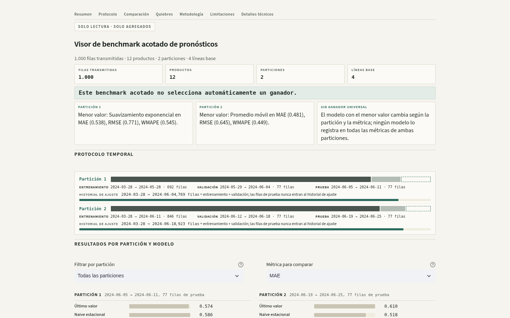
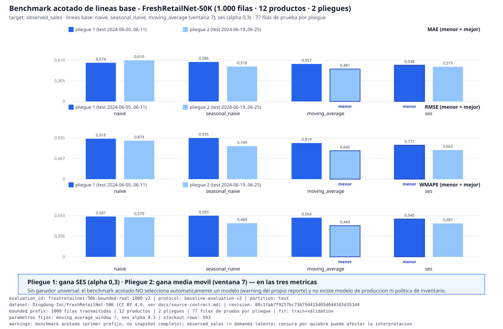
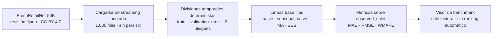

# Demand Inventory Optimizer

> Un producto de datos Python-primero para pronóstico de demanda **comparable y honesto**: ingestión de FreshRetailNet-50K, divisiones temporales deterministas, cuatro líneas base explicables y un benchmark real acotado con protocolo corregido. La simulación de políticas, la optimización y la recuperación de demanda latente siguen pendientes.

**Estado:** `baseline-evaluation-v2` · `bounded-real-evaluation` · `demo-ready` — las conclusiones describen un benchmark acotado de 1.000 filas, **no** un modelo de producción ni una política de inventario.



*Visor de solo lectura (Streamlit) del benchmark acotado: renderiza el reporte congelado `freshretailnet-50k-bounded-real-1000-v2.json` sin hardcodear ningún valor. Es un visor de benchmark, no un modelo de producción ni una política de inventario.*

## 🧭 En una mirada

- **Qué es:** un pipeline de evaluación de pronóstico de demanda reproducible: ingesta validada de FreshRetailNet-50K (revisión fijada `08c1fab7f9257bc73679d415d65d644165d351d4`), cargador de streaming acotado (exactamente 1.000 filas, sin persistir datos en vivo), divisiones temporales solo-stdlib y cuatro líneas base: `naive`, `seasonal_naive`, `moving_average` (ventana 7) y `ses` (α = 0,3).
- **Qué mide:** error de pronóstico sobre `observed_sales` (MAE, RMSE, WMAPE) por pliegue — con parámetros **fijos** y sin selección automática de modelo.
- **Qué dice el benchmark:** **SES gana el pliegue 1 y la media móvil gana el pliegue 2** en las tres métricas. No hay ganador universal, y el reporte lo dice explícitamente.
- **Qué no es:** `observed_sales` ≠ demanda latente (593 filas con quiebre de stock; la censura puede afectar la interpretación), y no existe modelo de producción, simulador ni optimizador.

## 🔎 Evidencia principal



| Modelo | Pliegue 1 (MAE / RMSE / WMAPE) | Pliegue 2 (MAE / RMSE / WMAPE) |
| --- | --- | --- |
| `naive` | 0,574 / 0,918 / 0,581 | 0,610 / 0,874 / 0,570 |
| `seasonal_naive` | 0,586 / 0,935 / 0,593 | 0,518 / 0,750 / 0,484 |
| `moving_average` (ventana 7) | 0,557 / 0,819 / 0,564 | **0,481 / 0,645 / 0,449** |
| `ses` (α = 0,3) | **0,538 / 0,771 / 0,545** | 0,515 / 0,662 / 0,481 |

**Lectura honesta:** el modelo ganador cambia con el pliegue (SES en el 1, media móvil en el 2). Por eso el reporte **no selecciona automáticamente un ganador** (`warning` del propio artefacto): el siguiente paso honesto es más datos y más pliegues, no declarar un vencedor. Escala del benchmark: 1.000 filas transmitidas · 12 productos · 2 pliegues · 77 filas de prueba por pliegue · ajuste `train + validation` (769 / 923 filas) · las filas de prueba nunca se ajustan.

Protocolo y decisiones de diseño: [`docs/evaluation.md`](docs/evaluation.md). Reporte congelado: `data/evaluations/freshretailnet-50k-bounded-real-1000-v2.json`.

## Cómo funciona



1. **Ingestar y validar** — una fila diaria se expande en 24 registros horarios; se preservan los valores crudos de la fuente y se rechazan vectores inconsistentes (longitud ≠ 24, estados de stock ∉ {0, 1}, contadores que no cuadran).
2. **Transmitir acotado** — exactamente el prefijo fijado; la prueba de humo real no persiste ninguna fila en vivo.
3. **Dividir en el tiempo** — `validation_days = min(7, max(1, span//10))`; dos pliegues cuando el calendario observado lo permite; `test_excluded_from_fit: true`.
4. **Evaluar** — protocolo `baseline-evaluation-v2`: validación ajusta solo `train`; prueba ajusta `train + validation` ordenados; parámetros fijos sin ajuste automático.
5. **Mostrar** — visor Streamlit con barras HTML/CSS propias (sin librerías de gráficos), valor exacto junto a cada barra y una tabla oculta para lectores de pantalla.

Regla de pliegues (del reporte): `validation_days = min(7, max(1, span_dias//10))`, `test_days = validation_days`, `step_days = 14`; dos pliegues cuando el calendario observado (90 días, 2024-03-28…06-25) alcanza dos ciclos train/validation/test; `initial_train_days` es el resto del calendario.

## Ejecutar la demo

```bash
uv sync --extra demo
uv run streamlit run app/streamlit_app.py
```

- El visor lee solo el reporte v2 congelado en una ruta fija; no hace solicitudes en vivo, no carga el reporte v1 de diagnóstico y no expone controles de carga/ruta/URL.
- Captura de página completa (secundaria): [`docs/assets/demo-viewer-full.png`](docs/assets/demo-viewer-full.png).
- Validación local: `uv run pytest -q` · `uv run python -m compileall -q src/` · `uv lock --check`.
- Recorrido de la demo: [`docs/demo-script.md`](docs/demo-script.md).

## La ingesta, en detalle

| Campo canónico | Definición exacta |
| --- | --- |
| `sales_qty_observed` | `hours_sale[h]`, unidades originales — nunca se enmascara ni reemplaza |
| `stockout_flag` | `hours_stock_status[h] == 1` |
| `latent_demand_estimate` | `None` — nunca se estima en la ingesta |
| `sales_observation_state` | `'censored_or_partial'` cuando el estado es 1, si no `'uncensored'` |
| `stockout_hours_6_22` | `sum(hours_stock_status[6:22])` — ventana semiabierta derivada, no un campo de la fuente |

La validación a nivel de fila rechaza vectores horarios que no tengan longitud 24, estados de stock distintos de 0/1, contadores inconsistentes con el vector y `sale_amount` que no cuadre con `sum(hours_sale)`. Una validación de instantánea exige exactamente 865 `product_id` únicos para instantáneas completas.

## Para quién y qué responde

- **Equipos de retail y cadena de suministro** que necesitan pronósticos comparables y explicables antes de invertir en modelos complejos.
- **Candidatos de datos y ML** que demuestran protocolo de evaluación riguroso: divisiones temporales limpias, líneas base, error por pliegue y conclusiones sin sobreventa.

Pregunta central que responde con evidencia: **¿qué línea base de pronóstico se comporta mejor, y en qué pliegue?** — con la respuesta honesta de que el ganador cambia y que eso es exactamente lo que un benchmark acotado debe decir antes de construir algo más grande.

## Estado y hoja de ruta

Completado: auditoría de licencias y selección del dataset · adaptador de ingesta validado · cargador de streaming acotado (humo real de 1.000 filas) · divisiones temporales · líneas base · ejecutor de evaluación reproducible · protocolo corregido `baseline-evaluation-v2` · benchmark real acotado v2 · visor de solo lectura con captura.

Pendiente (explícito): evaluación sobre snapshot real completo · simulador de políticas de inventario y modelo de costos · comprobaciones de calidad de datos · demo de escenarios · modelos avanzados **solo después** de reportar las líneas base · optimización bajo restricciones · despliegue o recorrido grabado.

## Estructura

```text
app/streamlit_app.py              visor de benchmark acotado (solo lectura)
src/inventory_optimizer/          ingesta, streaming, pliegues, líneas base, evaluación
data/evaluations/                 reportes congelados v1 (diagnóstico) y v2 (benchmark)
docs/                             contrato de fuente, protocolo de evaluación, guion
tests/                            fixtures offline pequeños; ninguna prueba toca la red
```

## ⚠️ Limitaciones

- **Benchmark acotado, no snapshot completo.** Cubre a lo sumo las primeras 1.000 filas transmitidas de la revisión fijada; no representa el dataset completo ni una evaluación de producción.
- **`observed_sales` no es demanda latente.** 593 filas tienen quiebre de stock observado (708 con alguna hora en estado de quiebre); las ventas observadas siguen siendo ventas observadas — no se estima ni se recupera demanda latente, y los quiebres no se corrigen ni se enmascaran.
- **Sin ganador universal.** La selección automática de mejor modelo está explícitamente fuera del protocolo; los resultados por pliegue no se agregan en un ranking.
- **Sin modelo de producción ni optimizador.** No hay simulador de políticas de inventario, modelo de costos ni optimización bajo restricciones (roadmap pendiente).
- **12 productos, 2 pliegues, 90 días de calendario.** Producto 548 con fechas faltantes en el prefijo; el historial incompleto es una limitación declarada del propio reporte.
- **Censura por quiebre.** El error sobre ventas observadas puede estar sesgado por censura; el reporte lo conserva como advertencia explícita.

## Documentación

| Documento | Contenido |
| --- | --- |
| [`docs/evaluation.md`](docs/evaluation.md) | Protocolo `baseline-evaluation-v2`, pliegues y definiciones de métricas |
| [`docs/source-contract.md`](docs/source-contract.md) | Contrato de la fuente FreshRetailNet-50K y términos CC BY 4.0 |
| [`docs/demo-script.md`](docs/demo-script.md) | Guion del recorrido del visor |
| [`DESIGN.md`](DESIGN.md) | Decisiones de diseño del pipeline |

Artefactos versionados: `data/evaluations/freshretailnet-50k-bounded-real-1000-v2.json` (benchmark acotado, sin datos crudos) y el v1 de diagnóstico histórico. Los datos de la fuente no se redistribuyen: el fixture de pruebas es sintético y pequeño.

## Licencia

**Código original.** MIT (ver `LICENSE`).

**Datos y contenido de terceros.** FreshRetailNet-50K es CC BY 4.0 (`Dingdong-Inc/FreshRetailNet-50K`); los datos, captures, manifests y fixtures no quedan cubiertos por MIT y conservan sus términos independientes documentados (ver `docs/source-contract.md`). No se otorga ningún derecho implícito sobre material de terceros.
